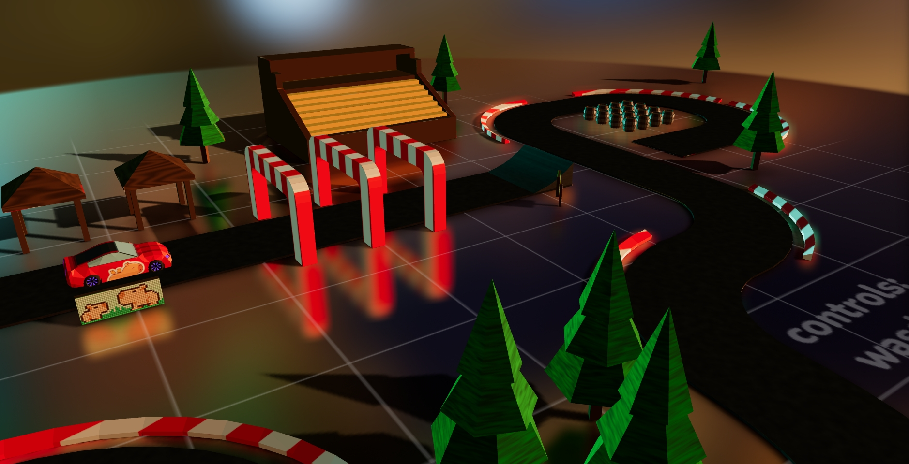
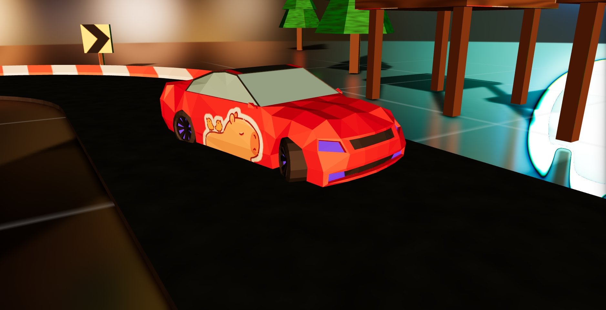

# R3F Car Racing

**A 3D web mini-game about driving a car.** Implemented using **react-three-fiber** and **cannon.js** technologies, the game aims to demonstrate **how impressive and varied the user experience with the browser can be.**

By driving a car around a small race track, manipulating objects and performing flips, the project is designed to not only be fun, but also show how flexible and powerful creating interactive content on the web can be.



## Project Structure and Technologies Used

The project uses the following key libraries and tools:

- **React-three-fiber (R3F)** - is a library for React designed to create 3D scenes using the three.js library. (Integration between Three.js and React)
- **Cannon.js** - is a physics engine for JavaScript designed to simulate the physics of objects. (For example, collisions and dynamic movements).
- **Blender** - is a powerful and free 3D modeling tool. It provides a wide range of tools for creating 3D objects and scenes.

```plaintext
R3F-CAR-RACING
├── public
│   ├── models/         // .glb objects
│   ├── textures/       // textures (not used directly)
│   └── screenshots/    // previews
├── src
│   ├── assets
│   │   └── global.css
│   │
│   ├── components      // r3f objects
│   │   ├── Scene.jsx   // main scene
│   │   ├── Track.jsx   // scene collisions
│   │   ├── Car.jsx     // car body (wheels, chassis, apply controls)
│   │   └── ...         // other scene elements
│   │
│   ├── hooks
│   │   ├── useWheels.jsx       // 4 wheel chassis
│   │   └── useControls.jsx     // using chassisApi and vehicleApi
│   │
│   └── main.jsx        // entrypoint
│
├── .gitignore
├── index.html
└── README.md  // <- u are here :^
```

## Get Started

Try the game right in your browser! [(click me)](https://DanieloM83.github.io/R3F-Car-Racing)

Ready to explore the code behind the scenes? Follow these simple steps to set up the project on your local machine:

```bash
git clone https://github.com/DanieloM83/R3F-Car-Racing.git

cd R3F-Car-Racing

npm install -g yarn  # npm comes bundled with Node.js

yarn  # download all dependencies (may take some time)

yarn dev  # start the project
```

This will launch the project on your local machine, and you can access it by navigating to (usually) http://localhost:5173 in your web browser.

## Screentshots

<div align="center">
    
    
    
    
    
</div>

## Acknowledgement

I'd like to thank the community of creators and teachers on YouTube whose ideas, code snippets, and detailed video tutorials were very helpful in developing this mini-project. The wealth of knowledge these people shared not only inspired my journey, but also enriched the development process.

- [**Low Poly Vehicles | Easy Beginner | Blender Tutorial**](https://www.youtube.com/watch?v=Zkg7Ol2jEjs)
- [**Make A Low Poly Barrel - Beginner Tutorial**](https://www.youtube.com/watch?v=0jWLjAaIEMg)
- [**The Best Volumetric Fog Shader (Blender Tutorial)**](https://www.youtube.com/watch?v=2SiCtnXVVFw)
- [**Car physics mini game with React Three Fiber and Three.js**](https://www.youtube.com/watch?v=wHw3Gh0IhNc)
- [**Texture Baking Blender Tutorials**](https://www.youtube.com/playlist?list=PLsGl9GczcgBvJPh7D_ITafvmTW7ZzQTEr)
